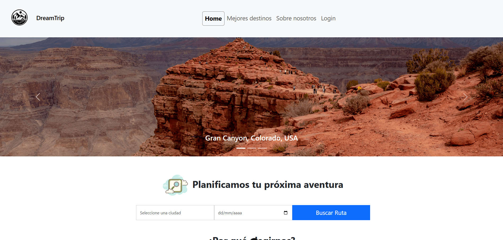
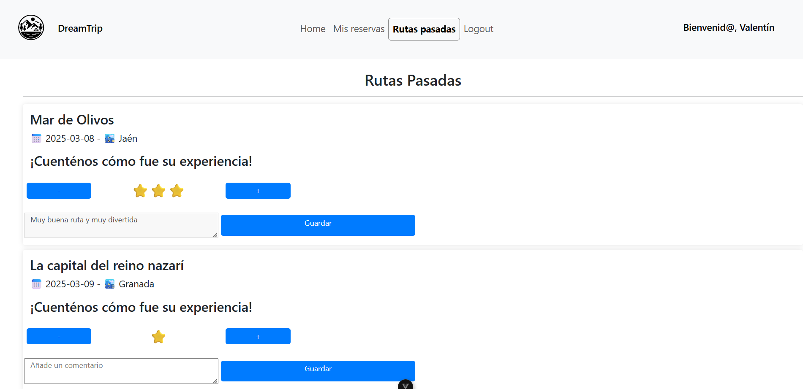
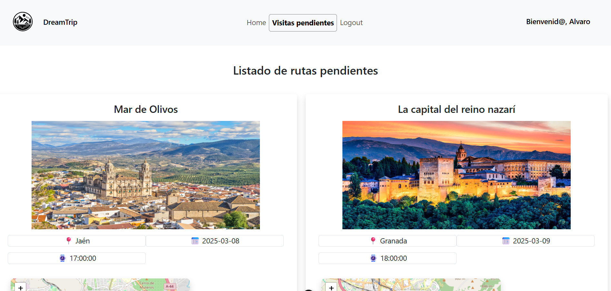
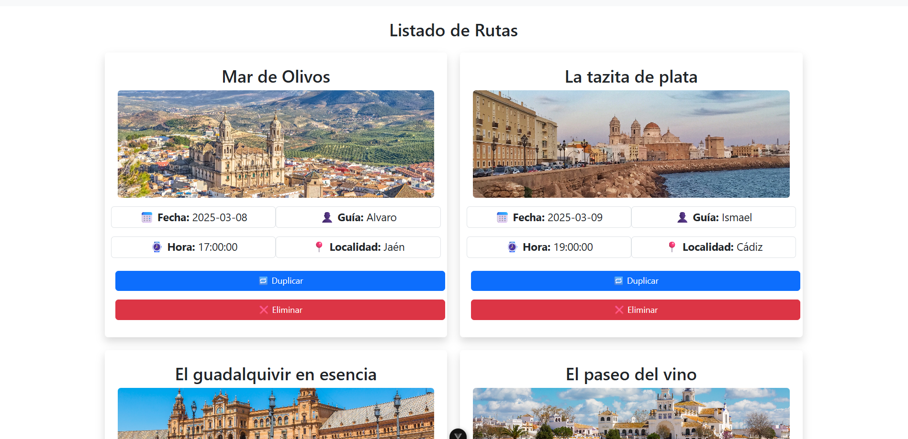

# 🌍 DreamTrip - Plataforma de Rutas Turísticas

¡Bienvenido a **DreamTrip**! Esta es una aplicación web desarrollada como proyecto del Segundo Trimestre del grado Superior de Desarrollo de Aplicaciones Web en los módulos de Desarrollo Web en entorno cliente y Diseño de interfaces Web, centrada en la gestión de rutas turísticas y la experiencia del usuario a través de valoraciones y reservas. 🚀

---

## 📌 Descripción del Proyecto

**DreamTrip** permite a los usuarios registrarse, reservar rutas turísticas, visualizar sus reservas (futuras y pasadas) y valorar las rutas una vez completadas. Está diseñada pensando en la experiencia del cliente, la accesibilidad y la facilidad de uso para los administradores, guías turísticos y clientes.

---

## 👥 Roles de Usuario

- **Cliente**:
  - Puede ver rutas disponibles y reservar.
  - Visualiza sus rutas futuras y pasadas.
  - Valora rutas pasadas con comentarios y estrellas.

- **Guía**:
  - Puede ver las rutas que se le han asignado.
 
- **Administrador**:
  - Gestiona los usuarios, eliminándolos o modificando su rol.
  - Gestiona las rutas, creando, modificando, eliminando y listándolas todas.
  - Asigna los guías a las rutas, excluyendo aquellos guías que en la fecha de la ruta ya tengan otra ruta asignada.
---

## 🔧 Tecnologías Utilizadas

| Tecnología | Descripción |
|------------|-------------|
| 🖥️ **Frontend** | Vue 3 |
| 🌐 **Backend/API** | PHP con arquitectura REST |
| 👑 **Estilos** | Bootstrap 5 |
| 🗃️ **Base de Datos** | MySQL (XAMPP para desarrollo local) |
| 📦 **Librerías externas** | SweetAlert2 para notificaciones |

---

## 🚦 Funcionalidades Principales

- 🔐 **Verificación** de contraseña desde el Front-End.
- 📅 **Listado de rutas** futuras y pasadas diferenciadas por fecha.
- ⭐ **Valoración** con estrellas y comentarios en rutas pasadas.
- 🖼️ **Vista previa** con imágenes, localidad, fecha y hora.
- ⚠️ **Redirección automática** si no se detecta sesión válida.

---

## ✨ Capturas de Pantalla

### Home Page 🏠

---

### Valoración de los usuarios ⭐⭐⭐

--- 

### Rutas pendientes de los guías 🚶‍♂️

---

### Visualización de rutas desde el administrador 🔐

---

## 🧠 Aprendizajes

Este proyecto me ha permitido reforzar:

- ✅ La integración de **Vue 3 con APIs REST**.
- ✅ La gestión de **sesiones en frontend**.
- ✅ Uso de librerías como **SweetAlert2**.
- ✅ La reutilización de componentes usando Bootstrap.
- ✅ El desarrollo de una **UI accesible y dinámica**.
- ✅ Organización del **código y documentación en GitHub**.

---

## 🤝 Agradecimientos

Gracias a quienes me han ayudado durante el desarrollo de este proyecto.  
Especialmente a compañeros, profesores y a la comunidad **Open Source**
de la que tuve que buscar docuementación acerca de este maravilloso
framework.

---

## 📩 Contacto

Puedes contactarme por correo y estaré encantado de conocernos:  
📧 **rrodfer05@gmail.com**

